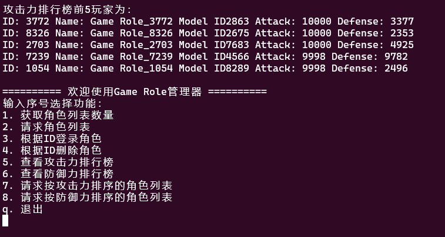

# Lesson 2 Lua表和面向对象使用

GitHub原链接 https://github.com/scyq/Game-dev-fundamental

## 文件目录和文件说明

-    **chat_service.lua** 服务端处理文件
-    **client.lua** 客户端文件
-    **config** 配置文件
-    **config.path** 路径配置文件
-    **GameRole.lua** GameRole类定义文件
-    **GameRoleMgr.lua** GameRoleMgr类定义和函数实现文件
-    **LocalTest.lua** 本地测试文件
-    **main.lua** 服务端启动文件
-    **README.md** 本文件
-    **utils.lua** 工具函数文件

## utils.lua 解析

文件utils.lua存放了几个可以跨文件使用的工具函数。

### 获取一个随机整数

利用时间来初始化随机种子，利用时间的随机性改善伪随机重复性。

```lua
-- 初始化随机种子
math.randomseed(os.time())

-- 获取一个随机整数
function GetRandomNumber(min, max)
    return math.random(min, max)
end
```

### 获取表的长度

如果表的Key不均为纯数字的话，不可以利用` #table_name`获取表的长度，而需要手动遍历来获取lua表的长度。

```lua
-- 获取表的长度
function TableLength(T)
    local count = 0
    for _ in pairs(T) do count = count + 1 end
    return count
end
```

### 根据指定字符串分割字符串

利用string.gsub和正则表达式利用reps字符串将str字符串分割为若干个字符串并返回。

```lua
-- 根据指定字符串分割字符串
function Split(str, reps)
    local result = {}
    local exe_res = string.gsub(str, '[^' .. reps .. ']+', function(w)
        table.insert(result, w)
    end)
    return result
end
```

### 将哈希表转为线性表 

将Key为字符串的哈希表转为Key为序号的线性表，可用于排序。

```lua
-- 将哈希表转为线性表
function Table2List(table)
    local temp = {}
    local cnt = 1
    for k, v in pairs(table) do
        temp[cnt] = v
        cnt = cnt + 1
    end
    return temp
end
```


## Part1 解析

### GameRole元表定义

为了保持GameRole元表继承链完整，以及在派生对象查找表内元素时能回溯到元表，需要设定` GameRole.__index = GameRole` 

```lua
-- 元表和基类定义
GameRole = {
    ID = 0,
    name = "",
    modelID = 0,
    attack = 0,
    defense = 0,
}
-- 为了元表继承链和Metatable寻找
GameRole.__index = GameRole
```

### GameRole构造函数

lua最基本的构造函数，将GameRole作为metatable派生对象的元表。

```lua
-- 实现构造函数
function GameRole:new(ID, name, modelID, attack, defense)
    local o = {}
    setmetatable(o, self)
    o.__index = self
    o.ID = ID or 0
    o.name = name or ""
    o.modelID = modelID or 0
    o.attack = attack or 0
    o.defense = defense or 0
    return o
end
```

### GameRoleMgr元表定义和构造函数

为了后续扩展和多管理，我将GameRoleMgr也实现为可派生的类。为了方便实现排序、删除（删除后补全）等方法，GameRoleMgr维护了一个role_table，用数字ID检索不同的GameRole。

```lua
GameRoleMgr = {
    role_table = {},
}
GameRoleMgr.__index = GameRoleMgr

function GameRoleMgr:new()
    local o = {}
    setmetatable(o, self)
    o.__index = self
    return o
end
```

###GameRoleMgr游戏角色管理相关函数

其中值得一提的是删除游戏角色的函数 ` del_role_by_id`，这里没有直接将对应id设置为 `nil`，而是用remove函数。因为如果表的Key值为数字时，元素删除后会自动补齐，不影响获取和排序。

而`get_role_by_id`必须要遍历，否则可能出现被补齐的情况。

```lua
function GameRoleMgr:add_role(role)
    self.role_table[role.ID] = role
end

function GameRoleMgr:del_role_by_id(role_id)
    table.remove(self.role_table, role_id)
end

function GameRoleMgr:get_role_by_id(role_id)
    -- 这里必须要遍历，否则可能存在被补齐的情况
    for k, v in pairs(self.role_table) do
        if (v.ID == role_id) then
            return v
        end
    end
    return nil
end
```

### 对游戏角色基于攻击力和防御力排序

为了防止篡改原表顺序，排序前要对表进行深拷贝，并且把Table完全转换为List保证正确性。排序需要传入自定义排序函数，使得排序后结果符合需求。

```lua
function GameRoleMgr:get_att_sort_list()
    -- 进行一次深拷贝，防止对原表进行修改，且转换为数组
    local temp = Table2List(self.role_table)
    -- 按照自定义方法从大到小排序
    table.sort(temp, function(a, b)
        return a.attack > b.attack
    end)
    return temp
end

function GameRoleMgr:get_def_sort_list()
    -- 进行一次深拷贝，防止对原表进行修改，且转换为数组
    local temp = Table2List(self.role_table)
    -- 按照自定义方法从大到小排序
    table.sort(temp, function(a, b)
        return a.defense > b.defense
    end)
    return temp
end
```

### 生成n个游戏对象

生成则重复调用`GameRole`的构造函数和`add_role`函数将生成的`role` 添加至表中。为了保证不重复，首先获取了角色列表的长度。

```lua
function GameRoleMgr:generate_role_list(n)
    -- 获得当前角色列表的长度, 防止ID重复
    local current_length = TableLength(self.role_table)

    for i = 1, n do
        local role = GameRole:new(current_length + i, "Game Role_" .. current_length + i,
            GetRandomNumber(0, 10000),
            GetRandomNumber(0, 10000), GetRandomNumber(0, 10000))
        self:add_role(role)
    end
end
```


## Part2 解析

### 通信部分修改哲学

1. 采用菜单制而非指令制从客户端读取用户输入。首先是因为菜单制比较好看，而且没有任何习得性门槛，符合产品设计哲学。
2. 客户端维护菜单的输出、清屏等功能。客户端会一次性读入用户当前想要做的操作和需要携带的参数。不是所有的操作都有参数（例如*查看角色列表数量*没有参数，而*请求角色列表*需要带上需要请求的个数）。为了尽量减少状态和通信次数，客户端将会把用户输入和参数用`##`连接一起打包发给服务端。
3. 服务端负责所有数据存储和处理，接收客户端请求、解析客户端请求、按需求返回数据。

### 客户端修改内容

#### 根据是否在腾讯云服务器自动导入包

由于云端和本地代码是同步的，频繁修改路径很麻烦，所以本着只修改一个变量就能自动调整路径的初衷进行lua包寻址的调整。

```lua
local online_server = false
local current_folder = "lesson_02" -- 当前文件夹名称，不需要加斜线
if online_server then
    package.path = package.path .. ";/home/ubuntu/Game-dev-fundamental/" .. current_folder .. "/?.lua"
else
    package.path = package.path .. ";/mnt/c/scyq/Game/dev-basic/Game-dev-fundamental/" .. current_folder .. "/?.lua"
end
```

#### 打印菜单

```lua
local function print_menu()
    print("========== 欢迎使用Game Role管理器 ==========")
    print("输入序号选择功能：")
    print("1. 获取角色列表数量")
    print("2. 请求角色列表")
    print("3. 根据ID登录角色")
    print("4. 根据ID删除角色")
    print("5. 查看攻击力排行榜")
    print("6. 查看防御力排行榜")
    print("7. 请求按攻击力排序的角色列表")
    print("8. 请求按防御力排序的角色列表")
    print("q. 退出")
end
```

#### 接收用户输入并打包

根据用户输入打包不同输入并显示不同的提示。

```lua
-- 打包用户输入的命令
local function get_user_option()
    -- option是用户输入的命令
    -- param是用户输入的参数
    local option = socket.readstdin()
    local param = nil

    if option == nil then
        return nil
    end

    if option == "1" or option == "5" or option == "6" or option == "q" then
        -- 1 5 6 q不需要额外读取参数，不处理参数
        return option .. "##"
    elseif (option == "2" or option == "3" or option == "4" or option == "7" or option == "8") then
        if option == "2" or option == "7" or option == "8" then
            print("请输入要查询的数量：")
            while param == nil do
                param = socket.readstdin()
            end
        elseif option == "3" then
            print("请输入要登录的角色ID: ")
            while param == nil do
                param = socket.readstdin()
            end
        elseif option == "4" then
            print("请输入要删除的角色ID: ")
            while param == nil do
                param = socket.readstdin()
            end
        end
    else
        print("未知指令")
        return nil
    end

    -- 打包用户的输入，前一段为用户选项，后一段为用户可能提供的参数
    return option .. "##" .. param
end
```

### 服务端修改内容

服务端主要增加了一个处理用户输入的大函数。

函数由两部分组成：

1. 解析用户输入，利用在`utils.lua`定义好的`Split(str, reps)`进行分词，前一部分为`option`即用户选择的操作，后一部分`param`为可能存在的参数。
2. 处理请求并返回。

这里代码有点像裹脚布，主要是有大量的字符串拼接，把多条角色的信息拼接在一条字符串中一起返回（lua没有设定字符串长度上限），这样减少通信次数。

```lua
-- 处理用户输入的命令包
local function parse_package(package)
    local parsed_packed = Split(package, "##")
    local option = parsed_packed[1]
    local param = parsed_packed[2]
    local str = ""

    -- 获取角色列表数量
    if (option == "1") then
        str = "当前角色数量为：" .. TableLength(manager.role_table)
        -- 请求角色列表
    elseif (option == "2") then
        str = "角色列表为：\n"
        for i = 1, tonumber(param) do
            local role = manager:get_role_by_id(i)
            str = str ..
                "ID: " ..
                role.ID ..
                " Name: " ..
                role.name ..
                " Model ID" .. role.modelID .. " Attack: " .. role.attack .. " Defense: " .. role.defense .. "\n"
        end
        -- 根据ID登录角色
    elseif (option == "3") then
        local role = manager:get_role_by_id(tonumber(param))
        if (role) then
            str = "登陆成功! 登陆信息ID: " ..
                role.ID .. " Name: " .. role.name .. " Model ID: " .. role.modelID .. " Attack: " .. role.attack ..
                " Defense: " .. role.defense
        else
            str = "未找到ID为" .. param .. "的角色"
        end
        -- 根据ID删除角色
    elseif (option == "4") then
        local role = manager:get_role_by_id(tonumber(param))
        if (role) then
            manager:del_role_by_id(tonumber(param))
            str = "删除ID为" .. param .. "的角色成功"
        else
            str = "未找到ID为" .. param .. "的角色"
        end
        -- 获取攻击力排序列表
    elseif (option == "5") then
        local arr = manager:get_att_sort_list()
        local cnt = 0
        str = "攻击力排行榜前十玩家为：\n"
        for k, v in pairs(arr) do
            cnt = cnt + 1
            if (cnt > 10) then
                break
            end
            str = str .. "Rank" .. cnt .. " Name: " .. v.name .. " Attack: " .. v.attack .. "\n"
        end
        -- 获取防御力排序列表
    elseif (option == "6") then
        local arr = manager:get_def_sort_list()
        local cnt = 0
        str = "防御力排行榜前十玩家为：\n"
        for k, v in pairs(arr) do
            cnt = cnt + 1
            if (cnt > 10) then
                break
            end
            str = str .. "Rank" .. cnt .. " Name: " .. v.name .. " Defense: " .. v.defense .. "\n"
        end
    elseif (option == "7") then
        str = "攻击力排行榜前" .. param .. "玩家为：\n"
        local arr = manager:get_att_sort_list()
        for i = 1, tonumber(param) do
            local role = arr[i]
            str = str ..
                "ID: " ..
                role.ID ..
                " Name: " ..
                role.name ..
                " Model ID" .. role.modelID .. " Attack: " .. role.attack .. " Defense: " .. role.defense .. "\n"
        end
    elseif (option == "8") then
        str = "防御力排行榜前" .. param .. "玩家为：\n"
        local arr = manager:get_def_sort_list()
        for i = 1, tonumber(param) do
            local role = arr[i]
            str = str ..
                "ID: " ..
                role.ID ..
                " Name: " ..
                role.name ..
                " Model ID" .. role.modelID .. " Attack: " .. role.attack .. " Defense: " .. role.defense .. "\n"
        end
    else
        str = "未知命令"
    end


    return str, option

end
```


## 部分测试结果

为了展示效果，我在云服务器上对按照攻击力排序的游戏角色分别请求5、500、5000、10000个角色。

### 5



### 500


### 5000


### 10000


