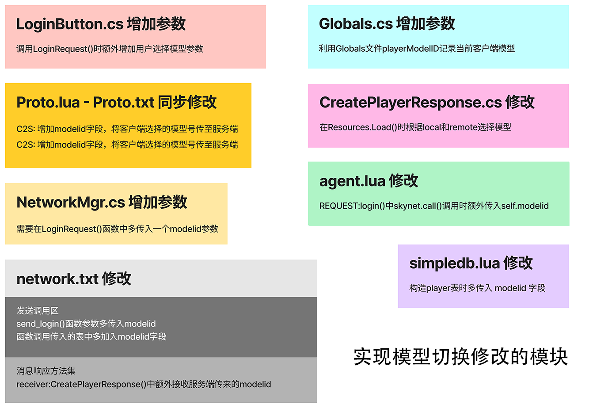
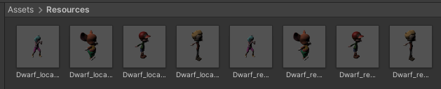
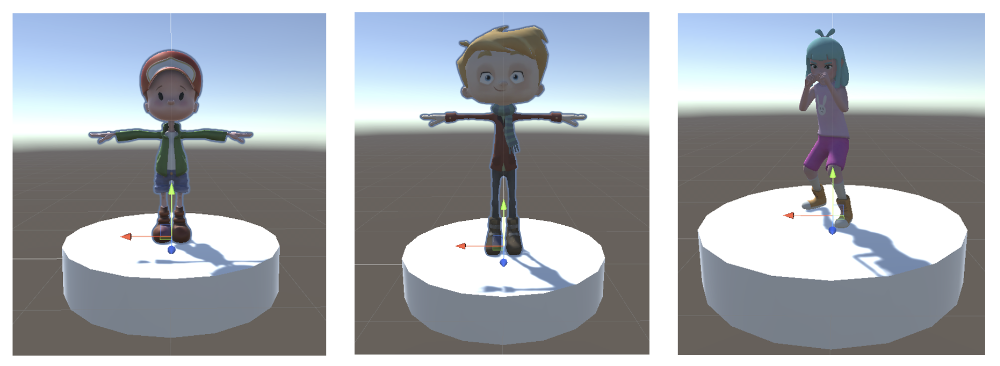
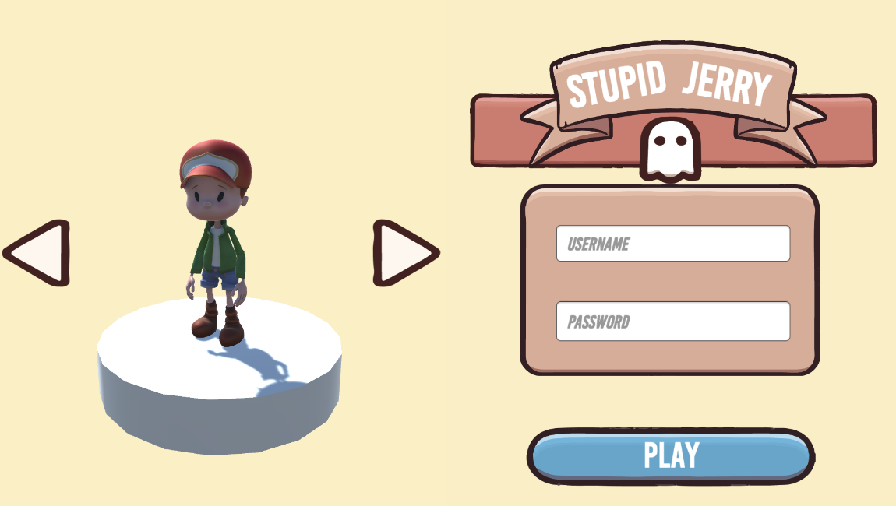
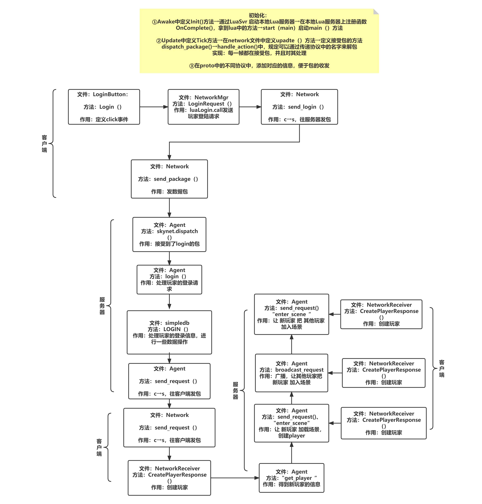
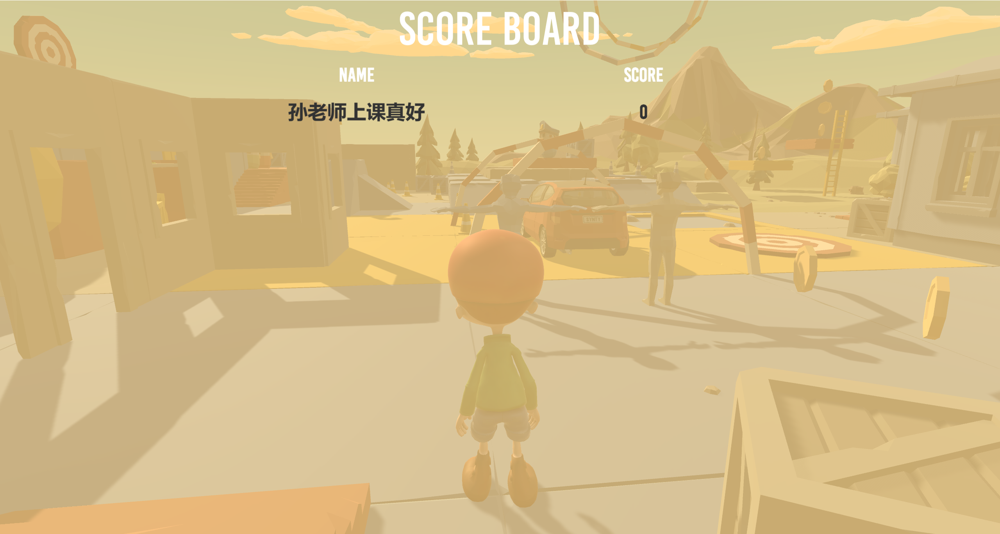

# Lesson 3 Skynet和Unity的结合，第一次多人联机游戏的尝试

GitHub原链接 https://github.com/scyq/Game-dev-fundamental

## 增加更改游戏角色模型选择功能



**上图为实现多人游戏中更改游戏角色模型选择功能所有修改的模块**

### 增加游戏模型

由于 `local` 和 `remote` 需要不同游戏模型和动画，对于每一个新的模型，需要导入两个相似但功能完全不同的Prefab，如下图所示。



### 模型选择界面设计

为了更好的人机交互，本小组设计3D与2D结合进行模型选择。我们将屏幕切分成两块，左边采用半屏宽的摄像机拍摄3D模型，右边采用半屏宽的Canvas作为账号密码输入。



如上图，底座+模型绑定，底座添加旋转代码。下图为最终界面。



### 代码控制切换模型

对于UI Canvas的切换按钮，绑定新 `ModelController` 脚本，加入 `ShowModel` 、`SwitchModel` 方法。

```c#
public class ModelController : MonoBehaviour
{

    public List<GameObject> modelList = new List<GameObject>();

    public void ShowModel()
    {
        for (int i = 0; i < modelList.Count; i++)
        {
            if (i == Globals.Instance.playerModelID)
            {
                modelList[i].SetActive(true);
            }
            else
            {
                modelList[i].SetActive(false);
            }
        }
    }

    public void SwitchModel(int value)
    {
        Globals.Instance.playerModelID += value;
        if (Globals.Instance.playerModelID >= modelList.Count)
        {
            Globals.Instance.playerModelID = 0;
        }
        else if (Globals.Instance.playerModelID < 0)
        {
            Globals.Instance.playerModelID = modelList.Count - 1;
        }

        ShowModel();
    }

}
```

### NetworkReceiver.cs脚本中添加Resources分类函数

根据服务器回传的 `player model` 信息以及 `local` 或 `remote` 获取对应资源文件名称。

```c#
private string GetModelNameByID(bool remote, int index)
{

    string res = "";
    string suffix = "";
    switch (index)
    {
        case 0:
            suffix = "redboy";
            break;
        case 1:
            suffix = "yellowboy";
            break;
        case 2:
            suffix = "girl";
            break;
        default:
            suffix = "jerry";
            break;
    }

    if (!remote)
    {
        res = "Dwarf_local_";
    }
    else
    {
        res = "Dwarf_remote_";
    }

    return res + suffix;
}
```

## 服务器同步

由于这次涉及在Unity中调用Lua脚本实现客户端和服务端通信，流程链条比较复杂，绘制以下图帮助理解。



文字可以将流程简化为：

1. 首先修改proto，使其在Login时发送modelid
2. 其次修改NetworkMgr，使其将modelid包含在login请求中一并发送     
3. 修改network，使其在发送login请求时时传递modelid
4. 修改agent，处理发送的login请求，将modelid一并放入数据库
5. 修改simpledb，将modelid放入数据库
6. 修改LoginButton.Login，使其传入modelid 

## 额外功能

### 吃金币（未实现）

由于游戏场景中有很多散落的金币模型，很容易想到设计吃金币大赛的游戏。

但因为时间和技术实现原因，没有想到很好的设计思路。

原思路为：

1. 给所有金币在服务端分配 `id` 和 `坐标`，在服务端管理金币的生成和销毁
2. 客户端只负责触发金币消失的并传输碰撞信息

最后只实现为客户端吃金币，服务端未同步。

### 得分表（不完善）

由于游戏中看不到服务器中有多少玩家很容易造成困惑，我们加入按下 `tab` 键可以查看所有玩家。



**多人效果详见视频**


### 

